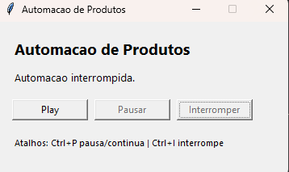

# Automacao com Python

Projeto desenvolvido por mim, Luana Mozer, para praticar automacao de tarefas repetitivas com Python, transformando um processo manual de cadastro de produtos em uma rotina controlada por interface grafica, atalhos de teclado e executavel para Windows.

## Sobre o projeto

Neste projeto eu criei uma automacao que abre o navegador, acessa a pagina de login, faz o preenchimento das informacoes e cadastra produtos automaticamente a partir de uma base em CSV.

A ideia principal foi simular uma rotina real de backoffice: pegar uma planilha de produtos e reduzir o trabalho manual de copiar, colar e enviar cadastro por cadastro.

Para deixar o projeto mais completo, eu tambem criei uma janela com botoes de controle:

- **Play**: inicia a automacao.
- **Pausar**: pausa a execucao sem fechar o programa.
- **Continuar**: retoma a automacao depois da pausa.
- **Interromper**: para o processo com seguranca.
- **Ctrl+P**: pausa ou continua pelo teclado.
- **Ctrl+I**: interrompe pelo teclado.

## Resultado visual

### Tela do executavel



### Tela de login automatizada


### Preenchimento automatico do cadastro


### Cadastro preenchido


### Video da automacao funcionando

[Clique aqui para assistir ao video da automacao funcionando](Video/Automacao%20funcionando.mp4)

## Tecnologias utilizadas

- Python
- PyAutoGUI
- Pandas
- Keyboard
- Tkinter
- PyInstaller
- CSV
- Git e GitHub

## O que eu pratiquei

- Leitura de arquivos CSV com `pandas`.
- Automacao de teclado e mouse com `pyautogui`.
- Controle de pausa e interrupcao usando eventos com `threading`.
- Interface grafica simples com `tkinter`.
- Criacao de atalhos globais com `keyboard`.
- Geracao de executavel com `PyInstaller`.
- Organizacao de projeto com imagens, video e arquivo executavel.
- Documentacao do projeto para portfolio.

## Estrutura do projeto

```text
Automacao com Python/
├── Automacao.py
├── Automacao.exe
├── produtos.csv
├── pegar_posicao.py
├── IMG/
│   ├── Executavel.png
│   ├── Tela de Login.png
│   ├── Preenchimento de cadastro.png
│   └── Site Preenchido.png
├── Video/
│   └── Automacao funcionando.mp4
├── Executável/
│   └── Automacao.exe
└── README.md
```

## Como executar pelo Python

1. Clone o repositorio:

```bash
git clone https://github.com/Luana-Mozer/Automacao-com-Python.git
```

2. Acesse a pasta do projeto:

```bash
cd Automacao-com-Python
```

3. Crie um ambiente virtual:

```bash
python -m venv .venv
```

4. Ative o ambiente virtual no Windows:

```bash
.venv\Scripts\activate
```

5. Instale as dependencias:

```bash
pip install pandas pyautogui keyboard pyinstaller
```

6. Execute o projeto:

```bash
python Automacao.py
```

## Como executar pelo arquivo .exe

Tambem deixei um executavel pronto para Windows.

Basta abrir o arquivo:

```text
Automacao.exe
```

Ao abrir, aparece a interface com os botoes **Play**, **Pausar** e **Interromper**.

## Como gerar o executavel novamente

Se eu alterar o codigo e quiser gerar um novo `.exe`, posso usar:

```bash
python -m PyInstaller --onefile --windowed --name Automacao --add-data "produtos.csv;." --distpath "." Automacao.py
```

No meu caso, eu usei uma `.venv` para deixar as dependencias separadas e evitar conflito com outros projetos.

## Observacoes importantes

- A automacao usa coordenadas da tela, entao pode precisar de ajuste se a resolucao, o zoom do navegador ou o layout da pagina mudarem.
- O arquivo `produtos.csv` precisa estar na pasta do projeto ou junto do executavel.
- O campo de senha esta como exemplo e deve ser ajustado antes de usar em um ambiente real.
- O projeto foi feito com foco em aprendizado, documentacao e portfolio.

## Aprendizados

Esse projeto foi muito importante para mim porque juntou varios pontos que eu venho estudando: Python, automacao, dados, interface grafica e empacotamento em executavel.

Mais do que apenas automatizar cliques, eu consegui transformar um script em uma ferramenta mais usavel, com controle visual, pausas, interrupcao e uma estrutura melhor para apresentar no GitHub e no meu portfolio.

## Autora

Desenvolvido por **Luana Mozer**.

- GitHub: [github.com/Luana-Mozer](https://github.com/Luana-Mozer)
- LinkedIn: [linkedin.com/in/luanamozer](https://www.linkedin.com/in/luanamozer/)
- Portfolio: [luana-mozer.github.io/PORTIFOLIO](https://luana-mozer.github.io/PORTIFOLIO/)
